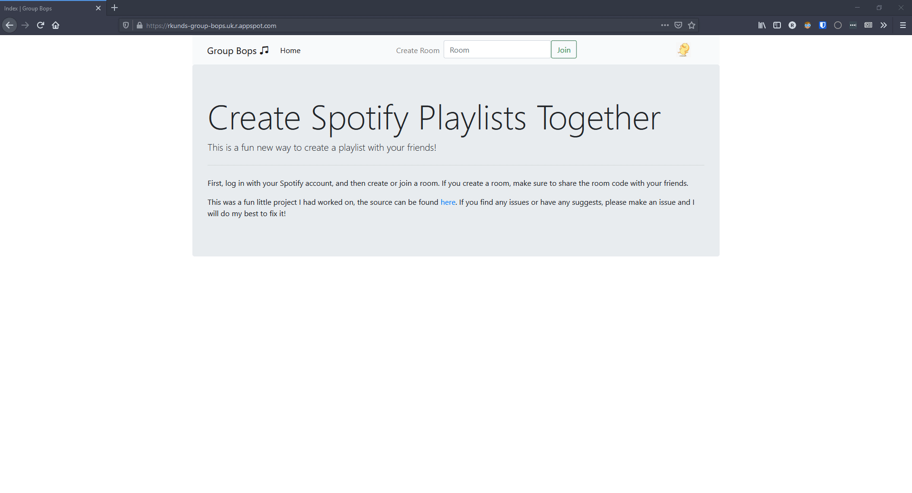

# Group Bops!

## About
Hey! This is a web app made to create an alternative and fun way to make Spotify
playlists with your friends. 

It is made in Python using the Flask web framework, and uses Spotipy as a helper 
module in order to authenticate the users. This app utilises the Spotify API to
get recommendations and get song data for the end user.  

The swiping animation and logic was created by [Simone P.M.](https://github.com/simonepm) with some modifications to accomdate this specific use case.

I made this for more practice with Python, as well as an introduction to MongoDB and databases. 

Try it out [here](https://rkunds-group-bops.uk.r.appspot.com/)

## Example Usage

Here is an example of a user joining a room and selecting seed songs for recommendations. They then start
interacting with the given songs in order to start generating the playlist for the room. 

## Future Plans / Updates

- Make website prettier (custom css instead of bootstrap)
- Make code more consistent, proper REST API endpoints and requests
- Solve User Login Issue (host app on different platform)
- Dockerize application
- Reduce number of requests made to Spotify
